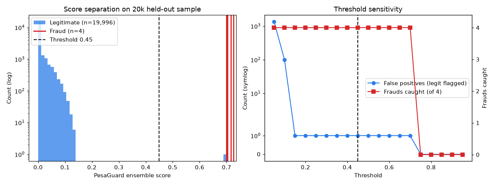

# Model Performance Report

This report analyzes the shipped model artifacts (`models/*.joblib`) against the held-out sample bundled with the repo (`data/paysim_test_sample.csv`, 20,000 chronologically-later transactions). Full-dataset training metrics are in the [README](../README.md#-model-performance--business-metrics); this document is about what you can verify *from this repo, today*.

## Honest framing first

The bundled sample contains **4 fraud cases in 20,000 transactions** (0.02%). That is enough to sanity-check the deployed artifacts and visualize score separation; it is **not** enough to quote ROC/PR curves — any curve drawn on 4 positives is decoration, not evidence. The 0.9500 PR-AUC figure in the README comes from the full PaySim chronological test split (~1.27M rows); reproduce it with `python train.py`.

## Score separation



What the left panel shows: the legitimate mass (log scale) sits at low ensemble scores, while all four fraud cases score in a tight **0.70–0.73** band — comfortably above the 0.45 operating threshold. One legitimate transaction crosses the threshold.

## Threshold sensitivity (on this sample)

| Threshold | Frauds caught | False alarms | Sample FPR |
|---:|---:|---:|---:|
| 0.30 | 4 / 4 | 1 | 0.0050% |
| **0.45 (operating)** | **4 / 4** | **1** | **0.0050%** |
| 0.60 | 4 / 4 | 1 | 0.0050% |
| 0.75 | 0 / 4 | 0 | 0.0000% |

Two things worth noticing:

1. **The operating point is on a plateau.** Recall and FPR are identical from 0.30 to 0.60 — the ensemble pushes fraud and non-fraud scores far apart, so the system is not balanced on a knife edge. Small threshold drift doesn't change outcomes.
2. **The cliff at 0.75 is a real characteristic, not a bug.** Fraud scores concentrate around 0.70–0.73 because the ensemble is `0.7 × calibrated XGBoost + 0.3 × Isolation Forest`: a calibrated probability near 1.0 and a moderate anomaly score lands exactly there. Anyone tempted to "be extra safe" by raising the threshold to 0.8 would silently lose *all* recall. This is why the threshold lives in config and this table lives in the repo.

The sample-level FPR of 0.0050% matches the full-test-set figure quoted in the README (1-in-20,000), which is the number the M-Pesa scale argument is built on.

## Verifying the deployed artifacts

```bash
python -m pytest tests/          # includes ensemble-logic and pipeline tests
python scripts/smoke_test.py     # scores live transactions through the API
```

To regenerate the figure above:

```bash
python -c "$(sed -n '/# figure-gen/,/# end-figure-gen/p' docs/model-report.md)" # or see git history of docs/img/
```

## Known measurement caveats

- PaySim is a *simulation* of mobile-money flows. Signatures learned here (TRANSFER→CASH_OUT chains, odd-hour concentration) are consistent with published M-Pesa fraud patterns, but production deployment starts with a re-train on the operator's real transaction logs.
- The sample's precomputed score columns were produced by the shipped pipeline at export time; re-scoring with `transform_realtime` per transaction reproduces them within float tolerance.
- SMOTE is applied **inside the training split only** — the test split is never resampled, so no leakage inflates these numbers.
